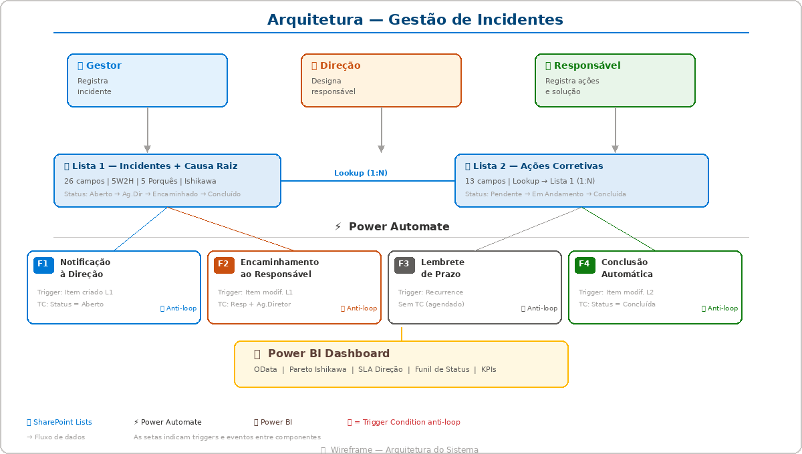
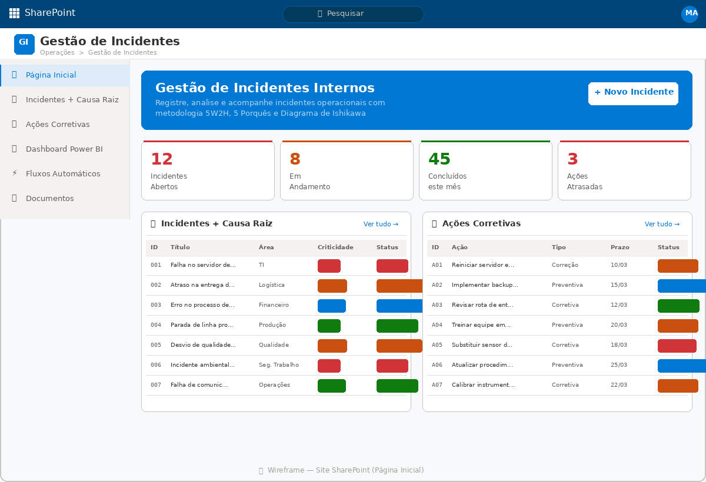
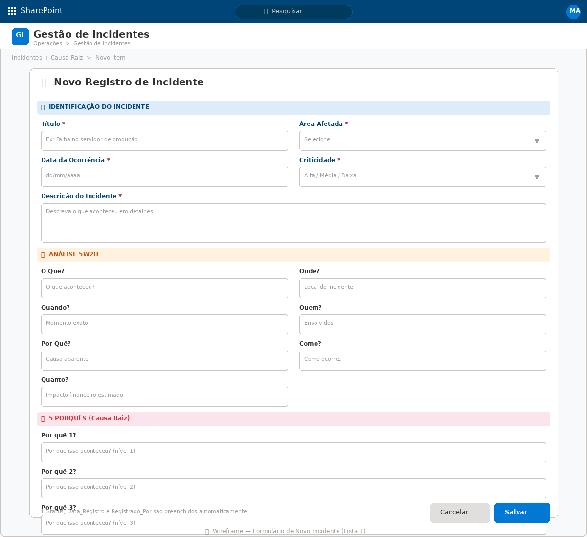
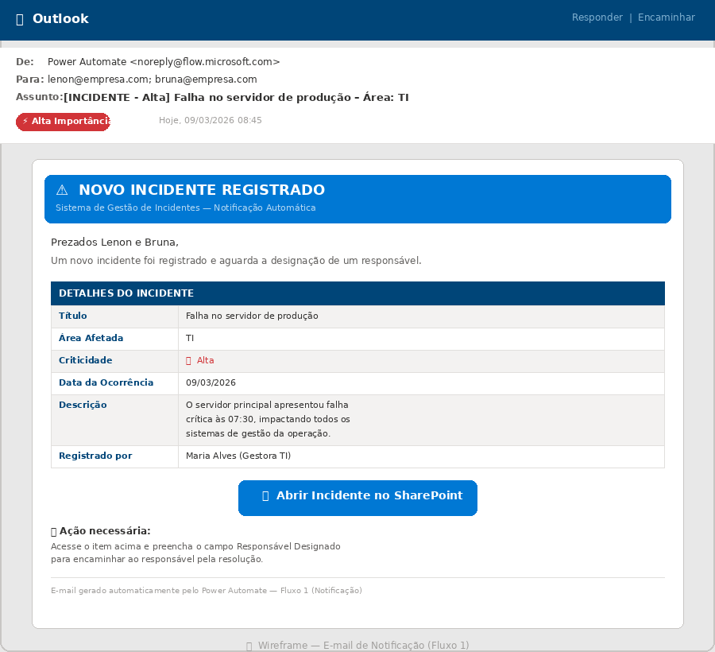
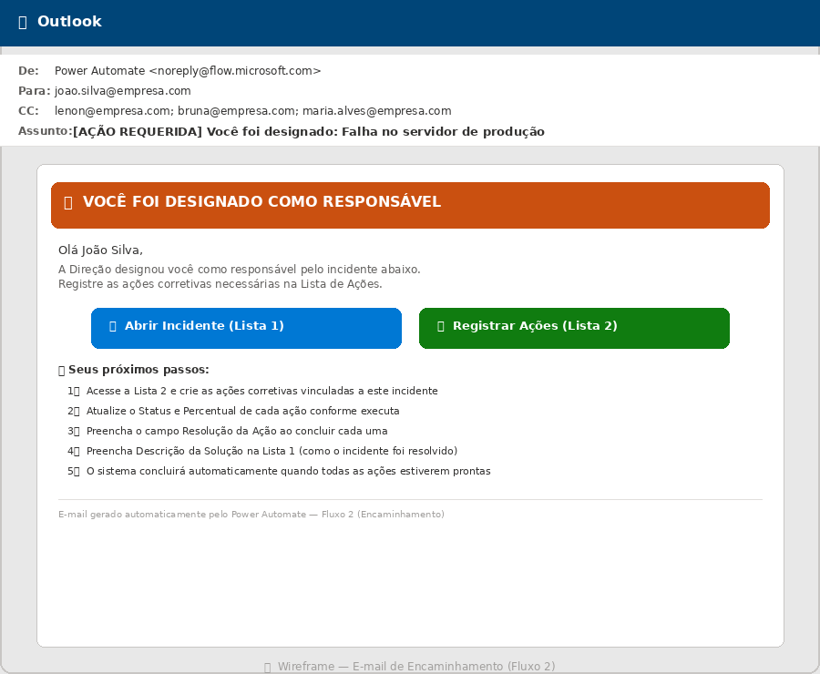
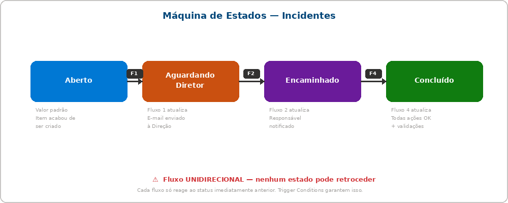

<p align="center">
  
</p>

<h1 align="center">🛡️ Gestão de Incidentes Internos</h1>

<p align="center">
  <strong>Sistema completo de registro, análise de causa raiz e acompanhamento de incidentes operacionais</strong><br>
  <em>SharePoint Online + Power Automate + Power BI</em>
</p>

<p align="center">
  
  
  
  
</p>

---

## 📌 Sobre o Projeto

Sistema low-code/no-code para **gestão de incidentes internos** construído inteiramente na stack Microsoft Power Platform. Permite que gestores de área registrem incidentes com análise estruturada (5W2H, 5 Porquês, Ishikawa), a direção designe responsáveis, e os responsáveis registrem e executem ações corretivas — tudo com automação de notificações, lembretes e conclusão.

### O que este projeto resolve?

| Problema | Solução |
|----------|---------|
| Incidentes registrados por e-mail/WhatsApp se perdem | Lista SharePoint centralizada com campos estruturados |
| Direção não é notificada em tempo real | Fluxo automático envia e-mail + Teams em incidentes críticos |
| Responsável não sabe o que fazer | E-mail de encaminhamento com link direto + passo a passo |
| Ações corretivas sem acompanhamento | Lista separada com status, prazo e lembrete diário automático |
| Incidentes ficam "abertos" para sempre | Conclusão automática com 3 camadas de validação |
| Sem visibilidade gerencial | Dashboard Power BI com KPIs, Pareto e funil de status |

---

## 🖥️ Como o sistema se parece

### Site SharePoint — Página Inicial

O site consolida ambas as listas, KPIs rápidos e acesso ao dashboard. Os gestores acessam pelo navegador ou app móvel do SharePoint.

<p align="center">
  <br>
  <em>Wireframe — Página inicial do site SharePoint com as duas listas e KPIs</em>
</p>

### Formulário de Novo Incidente (Lista 1)

O formulário guia o gestor pelas seções de identificação, análise 5W2H, 5 Porquês e classificação Ishikawa. Campos com `*` são obrigatórios.

<p align="center">
  <br>
  <em>Wireframe — Formulário nativo do SharePoint para registro de incidentes</em>
</p>

### E-mail de Notificação à Direção (Fluxo 1)

Quando um incidente é criado, Lenon e Bruna recebem este e-mail automaticamente com todos os detalhes e link direto para designar o responsável.

<p align="center">
  <br>
  <em>Wireframe — E-mail HTML enviado pelo Fluxo 1 (Notificação)</em>
</p>

### E-mail de Encaminhamento ao Responsável (Fluxo 2)

Após a direção designar o responsável, ele recebe um e-mail com instruções claras, links para ambas as listas e um passo a passo do que fazer.

<p align="center">
  <br>
  <em>Wireframe — E-mail HTML enviado pelo Fluxo 2 (Encaminhamento)</em>
</p>

---

## 🏗️ Arquitetura

<p align="center">
  
</p>

### Componentes

| Componente | Função |
|------------|--------|
| **Lista 1** — Incidentes + Causa Raiz | 26 campos · 5W2H · 5 Porquês · Ishikawa · Status do incidente |
| **Lista 2** — Ações Corretivas | 13 campos · Lookup 1:N → Lista 1 · Status da ação · Evidências |
| **Fluxo 1** — Notificação | Avisa a Direção por e-mail (+ Teams se Alta criticidade) |
| **Fluxo 2** — Encaminhamento | Envia ao responsável designado com links e orientações |
| **Fluxo 3** — Lembrete | Verifica prazos diariamente e alerta sobre ações atrasadas |
| **Fluxo 4** — Conclusão | Valida e conclui automaticamente quando todas as ações estão prontas |
| **Power BI** | Dashboard com KPIs, Pareto Ishikawa, SLA da Direção, funil de status |

### Relação entre as Listas

```
Lista 1 (Incidentes)          Lista 2 (Ações Corretivas)
┌────────────────────┐        ┌────────────────────┐
│ ID (auto)          │◄───┐   │ ID_Acao (auto)     │
│ Titulo             │    │   │ ID_Incidente_Ref ──┘  (Lookup 1:N)
│ Área_Afetada       │    │   │ Descricao_Acao     │
│ Criticidade        │    │   │ Tipo_Acao          │
│ 5W2H (7 campos)   │    │   │ Responsavel_Acao   │
│ 5 Porquês (5)      │    │   │ Prazo              │
│ Causa_Raiz         │    │   │ Status_Acao        │
│ Ishikawa (6M)      │    │   │ Resolucao_Acao     │
│ Status_Incidente   │    │   │ Evidencia          │
│ Responsavel_Desig. │    │   └────────────────────┘
│ Descricao_Solucao  │    │
│ Data_Encerramento  │    │      Um incidente pode ter
└────────────────────┘    │      N ações corretivas
                          └──────────────────────────
```

---

## 🔄 Máquina de Estados

<p align="center">
  <br>
  <em>Fluxo unidirecional — cada transição é controlada por um fluxo específico</em>
</p>

```
Aberto ──(F1)──► Aguardando Diretor ──(F2)──► Encaminhado ──(F4)──► Concluído
```

Regras:
- O status **nunca retrocede** — é unidirecional
- Cada fluxo só reage ao status **imediatamente anterior** ao que define
- **Trigger Conditions** no Power Automate garantem que nenhum fluxo dispare fora da sua transição

---

## 🛡️ Proteção Anti-Loop

> **Este é o aspecto mais crítico do projeto.** Sem proteção, os fluxos do Power Automate entram em loop infinito porque cada Update Item gera um novo evento de modificação.

### Cenários de loop identificados e soluções

| Cenário | Risco | Solução |
|---------|-------|---------|
| **A** — F1 auto-loop + disparo F2 | F1 atualiza Status → gera modificação | TC do F1: `Status = 'Aberto'` · TC do F2: `Responsavel preenchido AND Status = 'Ag. Diretor'` |
| **B** — F2 auto-loop | F2 atualiza Status → gera modificação | TC do F2: exige `Status = 'Aguardando Diretor'` (F2 muda para 'Encaminhado') |
| **C** — F4 dispara F2 | F4 atualiza Status → gera modificação na L1 | TC do F2: exige `Status = 'Aguardando Diretor'` (F4 define 'Concluído') |
| **D** — F4 auto-loop | Usuário re-edita item já concluído na L2 | Guarda: `varIncidenteJaConcluido` encerra se Status já = 'Concluído' |
| **E** — F2 cria item na L2 → F4 | F2 cria item-modelo na L2 | Trigger do F4 = modificação (não criação). Seguro. |

### Trigger Conditions — Copiar e Colar

```
# FLUXO 1 — Settings > Trigger Conditions
@equals(triggerOutputs()?['body/Status_Incidente/Value'], 'Aberto')

# FLUXO 2 — Settings > Trigger Conditions
@and(not(empty(triggerOutputs()?['body/Responsavel_Designado/Claims'])),equals(triggerOutputs()?['body/Status_Incidente/Value'], 'Aguardando Diretor'))

# FLUXO 3 — Sem Trigger Condition (agendado)

# FLUXO 4 — Settings > Trigger Conditions
@equals(triggerOutputs()?['body/Status_Acao/Value'], 'Concluída')
```

### Camadas de proteção

```
┌──────────────────────────────────────────────────────┐
│  CAMADA 1 — Trigger Conditions                       │
│  Expressões OData que impedem o fluxo de instanciar  │
│  Fluxos 1, 2 e 4 possuem TC obrigatória             │
├──────────────────────────────────────────────────────┤
│  CAMADA 2 — Máquina de Estados Unidirecional         │
│  Cada fluxo só reage ao status anterior ao que define│
│  Aberto → Ag.Diretor → Encaminhado → Concluído      │
├──────────────────────────────────────────────────────┤
│  CAMADA 3 — Variáveis de Guarda                      │
│  Booleanas que verificam estado antes de agir        │
│  Ex: varIncidenteJaConcluido no Fluxo 4              │
├──────────────────────────────────────────────────────┤
│  CAMADA 4 — Concurrency Control                      │
│  Degree of Parallelism = 1 nos Fluxos 1, 2 e 4      │
│  Evita race conditions com execuções simultâneas     │
└──────────────────────────────────────────────────────┘
```

---

## 📂 Estrutura do Repositório

```
gestao-incidentes-sharepoint/
│
├── README.md                                  ← Você está aqui
│
├── docs/
│   ├── projeto_gestao_incidentes.docx         ← Documento do projeto (11 seções)
│   ├── fluxos_power_automate.docx             ← Especificação técnica dos 4 fluxos
│   │
│   ├── img/                                   ← Wireframes / mockups
│   │   ├── mockup_site_sharepoint.png
│   │   ├── mockup_formulario_incidente.png
│   │   ├── mockup_email_notificacao.png
│   │   ├── mockup_email_encaminhamento.png
│   │   ├── mockup_arquitetura.png
│   │   └── mockup_maquina_estados.png
│   │
│   └── diagramas/                             ← Fluxogramas Mermaid
│       ├── visao_geral_fluxos.mermaid
│       ├── fluxo1_notificacao.mermaid
│       ├── fluxo2_encaminhamento.mermaid
│       ├── fluxo3_lembrete.mermaid
│       └── fluxo4_conclusao.mermaid
│
└── templates/                                 ← Artefatos copy-paste
    ├── email_fluxo1_notificacao.html          ← HTML do e-mail do Fluxo 1
    ├── email_fluxo2_encaminhamento.html       ← HTML do e-mail do Fluxo 2
    └── trigger_conditions.txt                 ← Expressões das Trigger Conditions
```

---

## 🚀 Guia de Implementação

### Pré-requisitos

- Microsoft 365 com licença que inclua SharePoint Online e Power Automate
- Permissão para criar listas e fluxos no ambiente
- Conector Office 365 Outlook habilitado
- (Opcional) Microsoft Teams para alertas de criticidade Alta
- (Opcional) Power BI Pro para o dashboard

### Passo a passo

**1. Criar o Site SharePoint**
- Criar site de equipe ou comunicação: "Gestão de Incidentes"
- Configurar navegação conforme o wireframe

**2. Criar a Lista 1 — Incidentes + Causa Raiz (26 campos)**
- Seguir a estrutura detalhada no arquivo `docs/projeto_gestao_incidentes.docx`
- Definir valor padrão de `Status_Incidente` = **"Aberto"**
- Campos obrigatórios: Título, Área_Afetada, Data_Ocorrência, Criticidade, Descrição

**3. Criar a Lista 2 — Ações Corretivas (13 campos)**
- Criar coluna Lookup `ID_Incidente_Ref` apontando para ID da Lista 1
- Definir valor padrão de `Status_Acao` = **"Pendente"**

**4. Criar os 4 Fluxos Power Automate (em ordem!)**
- **Ordem obrigatória**: F1 → F2 → F3 → F4
- Inserir **Trigger Conditions** ANTES de salvar (copiar de `templates/trigger_conditions.txt`)
- Configurar **Concurrency Control = 1** nos Fluxos 1, 2 e 4
- Copiar HTML dos e-mails de `templates/`
- Seguir passo a passo detalhado em `docs/fluxos_power_automate.docx`

**5. Testar com o roteiro de 8 cenários**
- O roteiro completo está no documento técnico (seção 8.2)
- Testar SEMPRE em ambiente de homologação antes de produção

**6. (Opcional) Conectar Power BI**
- Fonte: SharePoint Online List (conector OData)
- Métricas sugeridas: total por período/área/criticidade, SLA, Pareto, funil

---

## 📊 Métricas e KPIs sugeridos para Power BI

| Métrica | Descrição |
|---------|-----------|
| Incidentes por período | Total mensal/semanal por data de registro |
| Distribuição por criticidade | Alta / Média / Baixa (gráfico de rosca) |
| Pareto de categorias Ishikawa | 6M — onde se concentram as causas |
| SLA da Direção | Tempo médio entre registro e designação do responsável |
| Taxa de conclusão | % de incidentes concluídos vs. abertos |
| Ações atrasadas | Quantidade e lista de ações com prazo vencido |
| Funil de status | Aberto → Ag. Diretor → Encaminhado → Concluído |
| Top áreas afetadas | Ranking de áreas com mais incidentes |

---

## 🛠️ Stack Tecnológica

| Tecnologia | Uso |
|------------|-----|
| **SharePoint Online** | Listas estruturadas, formulários nativos, permissões |
| **Power Automate** | 4 fluxos automatizados com proteção anti-loop |
| **Office 365 Outlook** | Envio de e-mails HTML formatados |
| **Microsoft Teams** | Alertas em canal para incidentes de alta criticidade |
| **Power BI** | Dashboard gerencial com conexão OData |

### Metodologias integradas

- **5W2H** — What, Where, When, Who, Why, How, How much
- **5 Porquês** — Análise de causa raiz por encadeamento
- **Diagrama de Ishikawa (6M)** — Método, Máquina, Mão de obra, Material, Meio ambiente, Medição

---

## 📋 Roadmap

- [x] Estrutura das listas SharePoint (Lista 1: 26 campos, Lista 2: 13 campos)
- [x] Especificação dos 4 fluxos Power Automate com anti-loop
- [x] Templates HTML dos e-mails
- [x] Wireframes / mockups do sistema
- [x] Documentação técnica completa
- [x] Fluxogramas Mermaid (visão geral + 4 individuais)
- [ ] Implementação no ambiente SharePoint/Power Automate
- [ ] Testes com roteiro de 8 cenários
- [ ] Dashboard Power BI
- [ ] (Fase 2) Power Apps Canvas para interface personalizada

---

## 👥 Stakeholders

| Papel | Responsabilidade |
|-------|-----------------|
| **Gestores de Área** | Registram incidentes na Lista 1 |
| **Gerente (Lenon)** | Recebe notificação, designa responsável |
| **Diretora (Bruna)** | Recebe notificação, designa responsável |
| **Responsável Designado** | Cria e executa ações corretivas na Lista 2 |

---

## 📄 Licença

Este projeto é disponibilizado sob a licença MIT. Consulte o arquivo [LICENSE](LICENSE) para mais detalhes.

---

<p align="center">
  <strong>Desenvolvido com 💙 usando Microsoft Power Platform</strong><br>
  <em>SharePoint · Power Automate · Power BI</em>
</p>
